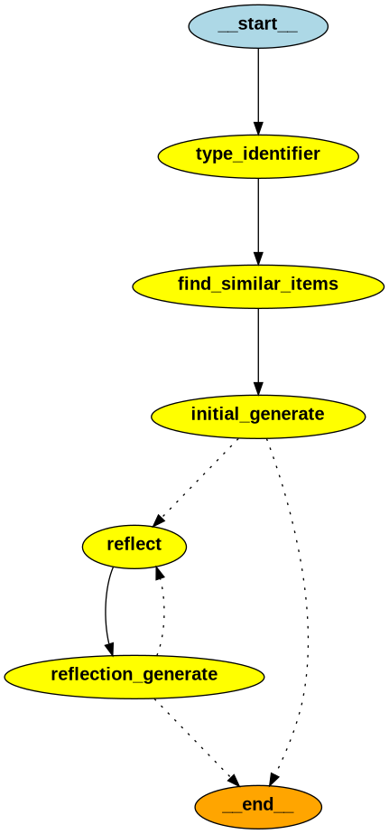

# Magical system
Tool to create magical items and effects from some initial parameters.

## Installation and usage
1. Install required libraries using uv.
2. Create .env file from .env_example file, using your API keys.
3. Download Ollama and required models if using local llm. 
4. Run dnd_converter.py, or agent_dnd_converter.py.

### agent_dnd_converter.py:

### Fixes
1. If you get errors in installing pygraphviz:
    - Make sure you have graphviz and graphviz-dev installed.
    - Try running sysconfigpatcher path/to/python/install
        - To install, run: uv tool install 'git+https://github.com/bluss/sysconfigpatcher'